# PeopleJob — 채용 플랫폼 (Flutter + Spring Boot)

> 구직자 · 기업 · 관리자를 위한 통합 채용 서비스 | Flutter 프론트엔드 × Spring Boot REST API 풀스택 프로젝트

<br>

<table>
  <tr>
    <td align="center">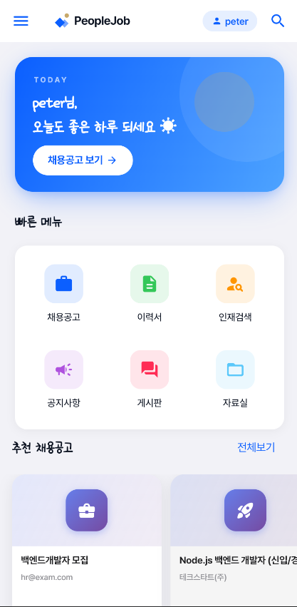<br/><sub>홈 화면</sub></td>
    <td align="center">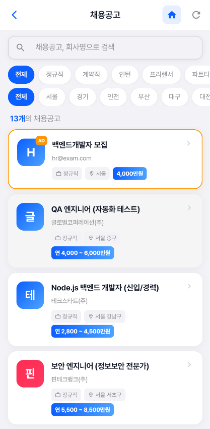<br/><sub>채용공고 목록</sub></td>
    <td align="center">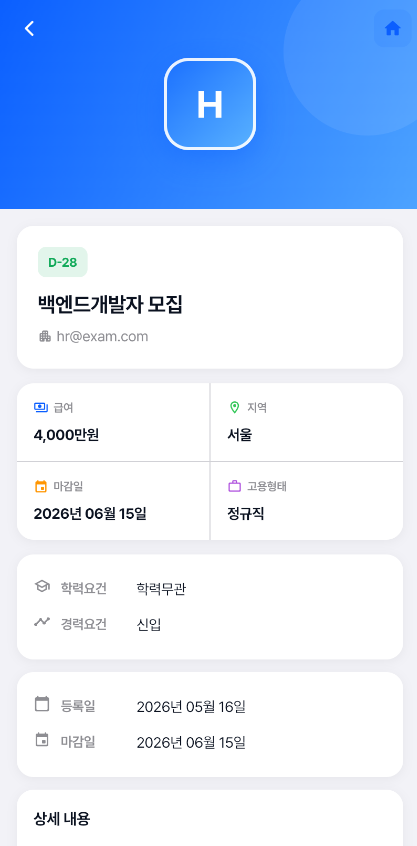<br/><sub>채용공고 상세</sub></td>
    <td align="center">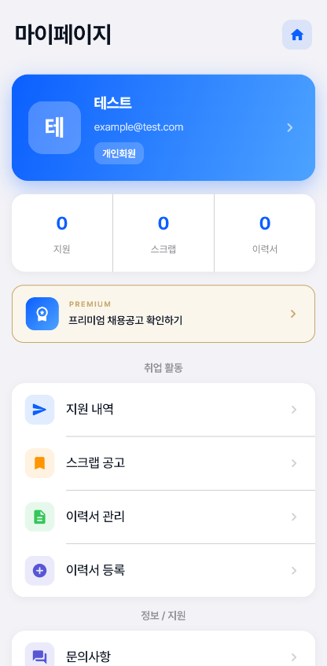<br/><sub>마이페이지</sub></td>
  </tr>
</table>

<br>

## 목차

1. [프로젝트 개요](#프로젝트-개요)
2. [스크린샷](#스크린샷)
3. [주요 기능](#주요-기능)
4. [기술 스택](#기술-스택)
5. [아키텍처](#아키텍처)
6. [디렉토리 구조](#디렉토리-구조)
7. [서비스 레이어](#서비스-레이어)
8. [상태 관리](#상태-관리)
9. [디자인 시스템](#디자인-시스템)
10. [API 연동](#api-연동)
11. [테스트](#테스트)
12. [빌드 및 배포](#빌드-및-배포)
13. [트러블슈팅](#트러블슈팅)

<br>

---

## 프로젝트 개요

**PeopleJob**은 구직자, 기업 채용담당자, 플랫폼 관리자 세 가지 역할을 지원하는 풀스택 채용 플랫폼입니다.
**Flutter**로 Android · iOS · Web 멀티플랫폼 UI를 구현하고, **Spring Boot** REST API 서버와 연동하여 채용공고·지원·이력서·결제·알림 등 전 도메인을 설계·개발했습니다.

| 항목 | 내용 |
|------|------|
| 프론트엔드 | Flutter 3.7.2+ — Android / iOS / Web 멀티플랫폼 |
| 백엔드 | Spring Boot 3 · Spring Security · JPA · MySQL |
| 언어 | Dart (프론트) / Java 17 (백엔드) |
| 인증 | JWT Bearer Token — 발급(Spring) · 저장(FlutterSecureStorage) |
| 아키텍처 | 프론트: 서비스 레이어 + Riverpod 상태 관리 / 백엔드: Controller-Service-Repository 레이어드 |
| 로케일 | 한국어 (ko_KR), 영어 (en_US) |

<br>

---

## 스크린샷

### 인증

로그인, 비밀번호 찾기 화면입니다. 아이디/비밀번호 입력 후 로그인 유지 옵션을 선택할 수 있으며, 비밀번호 찾기는 가입한 이메일로 재설정 링크를 발송합니다.

<table>
  <tr>
    <td align="center">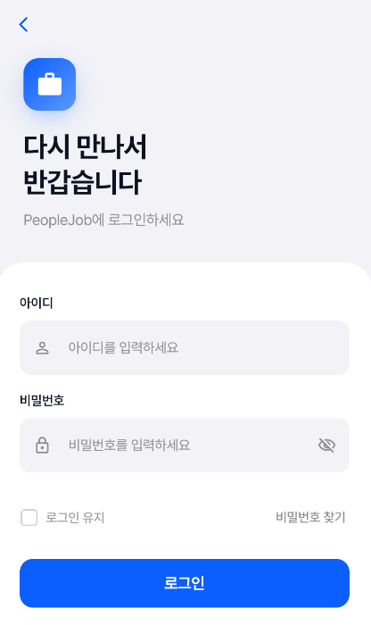<br/><sub>로그인</sub></td>
    <td align="center">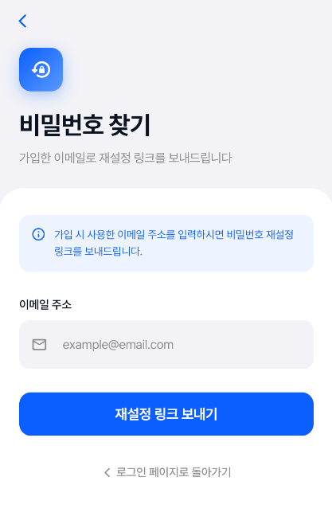<br/><sub>비밀번호 찾기</sub></td>
  </tr>
</table>

---

### 홈 화면

로그인한 사용자의 이름으로 개인화된 인사말 배너를 표시합니다. 채용공고·이력서·인재검색·공지사항·게시판·자료실 6개 빠른 메뉴와 추천 채용공고 카드 슬라이더를 제공합니다.

<table>
  <tr>
    <td align="center"><br/><sub>홈 화면 — 개인화 배너 · 빠른 메뉴 · 추천 공고</sub></td>
  </tr>
</table>

---

### 채용공고

고용형태(정규직·계약직·인턴·프리랜서·파트타임)와 지역(서울·경기·인천·부산·대구·대전 등) 필터 칩을 제공합니다. 프리미엄 광고 공고는 `AD` 배지와 주황색 테두리로 강조 표시됩니다. 상세 화면은 D-Day 배지, 급여·지역·마감일·고용형태 요약 카드, 학력/경력 요건, 전체 공고 내용을 포함합니다.

<table>
  <tr>
    <td align="center"><br/><sub>채용공고 목록 — 필터 · AD 배지</sub></td>
    <td align="center"><br/><sub>채용공고 상세 — D-Day · 요약 카드</sub></td>
  </tr>
</table>

---

### 이력서

**내 이력서** 페이지는 자신이 작성한 이력서만 노출하며, 빠른 등록을 위한 FAB(+) 버튼을 제공합니다. **이력서 등록** 화면에서는 프로필 사진 업로드, 이력서 제목, 희망직종·지역·근무형태를 칩 선택 방식으로 입력합니다.

<table>
  <tr>
    <td align="center">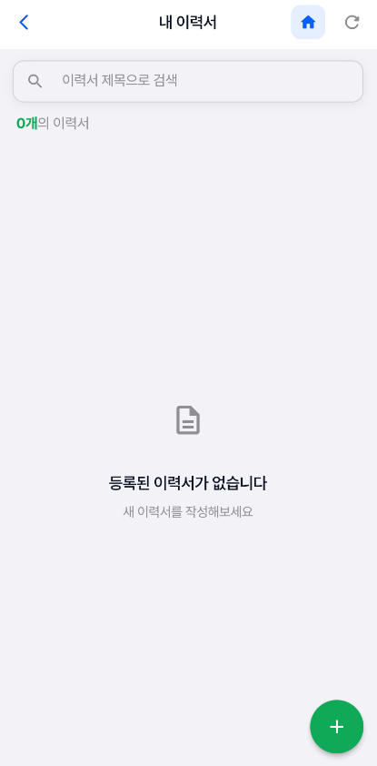<br/><sub>내 이력서 목록 (빈 상태)</sub></td>
    <td align="center">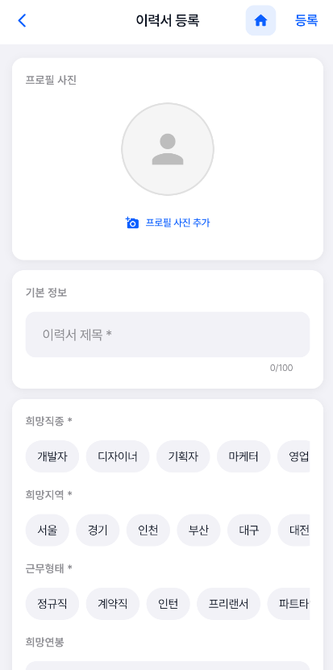<br/><sub>이력서 등록 — 프로필 사진 · 직종/지역 선택</sub></td>
  </tr>
</table>

---

### 인재정보 검색

기업 채용담당자가 희망 지역과 직무(백엔드·프론트엔드·iOS·안드로이드 등)로 구직자 이력서를 검색합니다. 검색 결과는 이력서 제목, 직종, 지역, 고용형태, 자기소개 미리보기를 카드 형태로 표시합니다.

<table>
  <tr>
    <td align="center">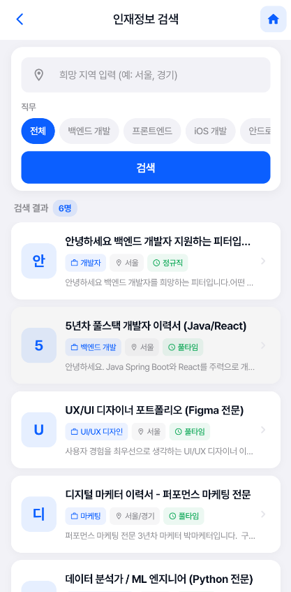<br/><sub>인재정보 검색 — 지역·직무 필터</sub></td>
    <td align="center">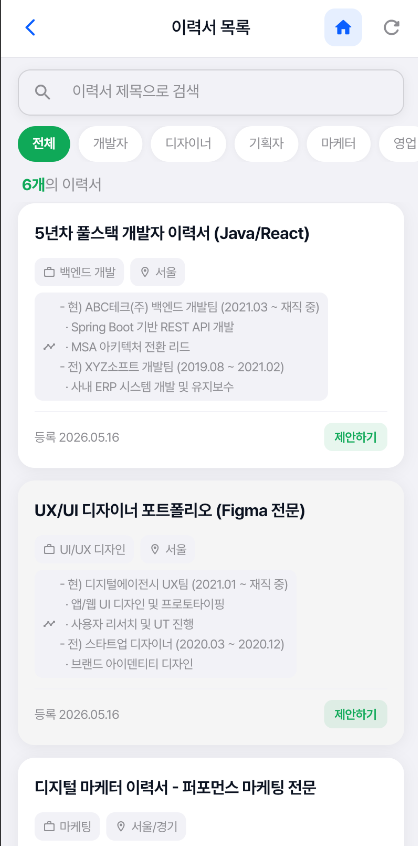<br/><sub>이력서 목록 — 직종 필터 · 제안하기</sub></td>
  </tr>
</table>

---

### 마이페이지 (개인)

프로필 카드(이름·이메일·회원 유형)와 지원·스크랩·이력서 현황을 한눈에 확인할 수 있습니다. 취업 활동(지원 내역·스크랩 공고·이력서 관리), 정보/지원(문의사항·자료실·게시판), 설정(내정보 수정·알림·비밀번호 변경) 메뉴를 제공합니다.

<table>
  <tr>
    <td align="center"><br/><sub>개인 마이페이지 — 통계 · 메뉴 그룹</sub></td>
    <td align="center">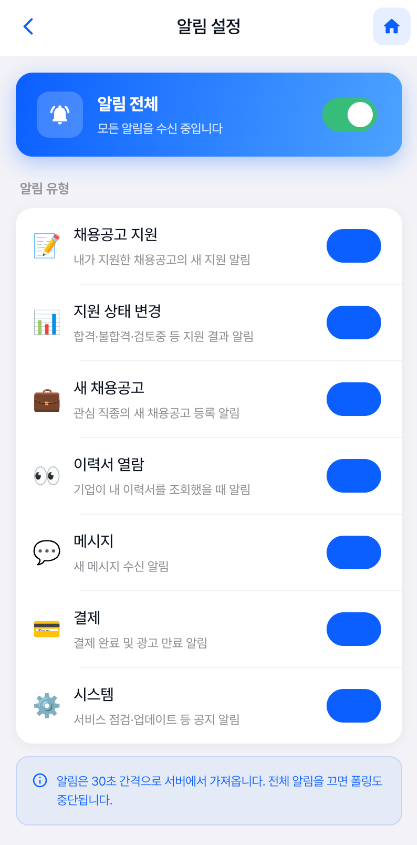<br/><sub>알림 설정 — 유형별 개별 토글 · 전체 on/off</sub></td>
  </tr>
</table>

---

### 기업 마이페이지 · 지원자 관리

기업 프로필 카드 아래 채용 관리(채용공고 등록·관리·지원자 관리), 기업 서비스(광고 신청·결제 내역·인재정보 검색), 정보 및 지원, 계정 설정 메뉴를 제공합니다. 지원자 관리에서는 공고별 지원자 목록과 개별 지원자의 이력서 보기·연락하기 기능을 사용할 수 있습니다.

<table>
  <tr>
    <td align="center">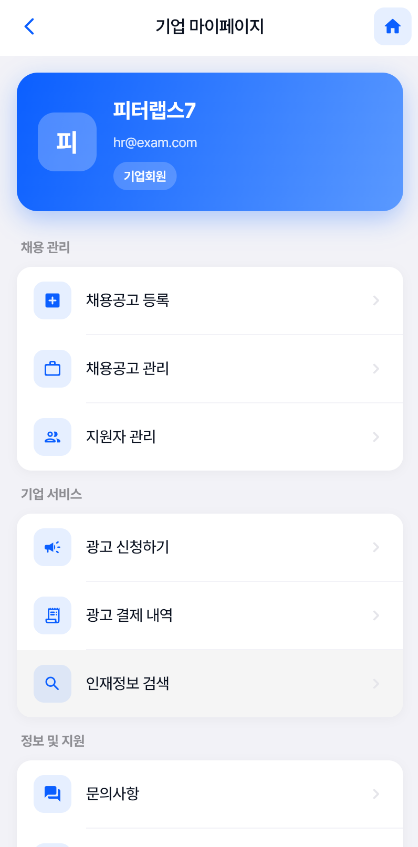<br/><sub>기업 마이페이지 — 채용·서비스 메뉴</sub></td>
    <td align="center">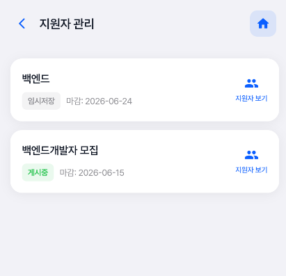<br/><sub>지원자 관리 — 공고별 목록</sub></td>
    <td align="center">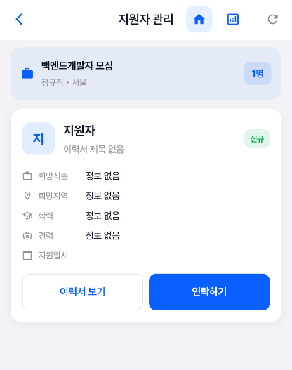<br/><sub>지원자 상세 — 이력서 보기 · 연락하기</sub></td>
  </tr>
</table>

---

### 광고 결제 시스템

채용공고 광고 신청부터 결제까지 5단계 플로우로 구성됩니다. Basic(10,000원 · 7일), Standard(30,000원 · 7일), Premium(50,000원 · 7일) 세 가지 상품을 제공하며, 광고 노출 기간은 7일·14일·30일 중 선택합니다. 결제 완료 후 영수증과 결제 내역 확인 화면으로 이동합니다.

<table>
  <tr>
    <td align="center">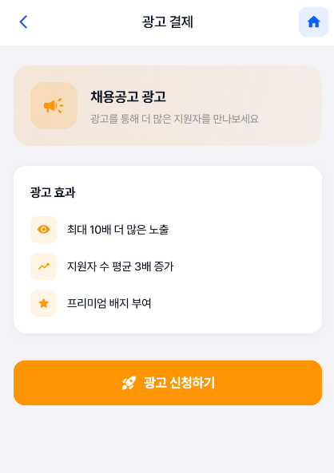<br/><sub>광고 효과 안내</sub></td>
    <td align="center">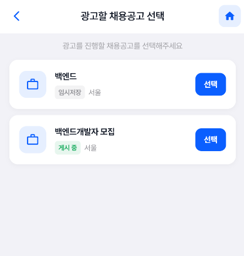<br/><sub>광고할 공고 선택</sub></td>
    <td align="center">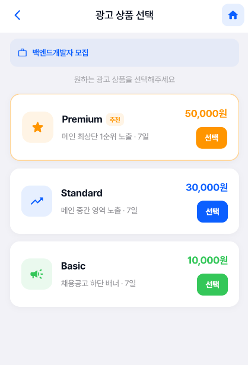<br/><sub>광고 상품 선택</sub></td>
  </tr>
  <tr>
    <td align="center">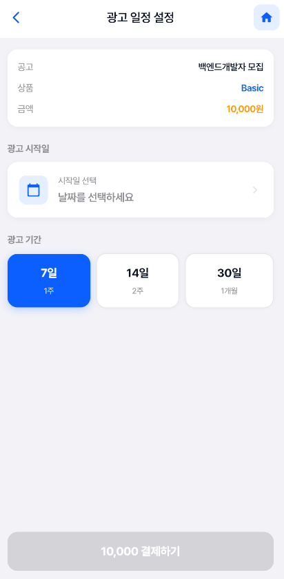<br/><sub>광고 일정 설정</sub></td>
    <td align="center">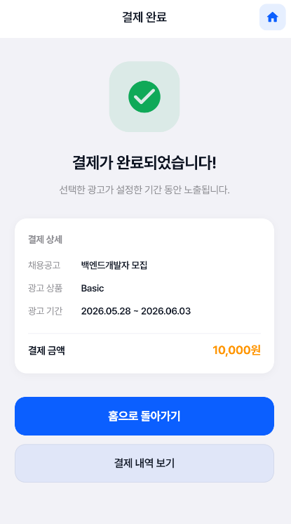<br/><sub>결제 완료 영수증</sub></td>
    <td align="center">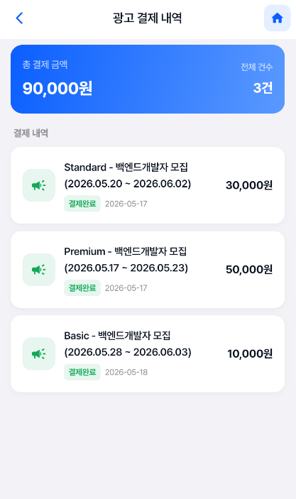<br/><sub>광고 결제 내역</sub></td>
  </tr>
</table>

---

### 게시판 · 공지사항 · 문의사항

게시판은 공지사항·자유게시판·질문게시판·취업정보 카테고리를 지원하며 제목·작성자로 실시간 검색이 가능합니다. 공지사항은 중요 공지를 빨간 배지로 강조 표시하고 공유 기능을 제공합니다. 1:1 문의는 제목과 상세 내용을 입력해 제출하며, 관리자의 답변을 앱 내에서 확인할 수 있습니다.

<table>
  <tr>
    <td align="center">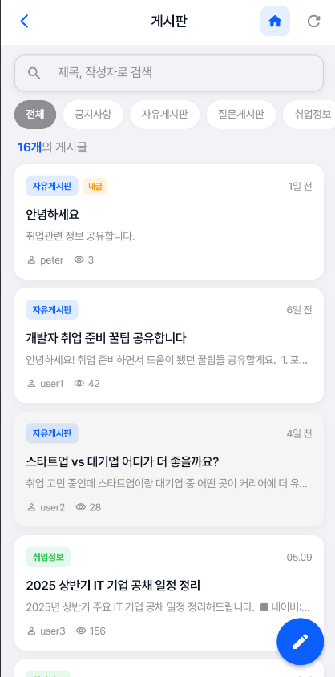<br/><sub>게시판 목록 — 카테고리 탭</sub></td>
    <td align="center">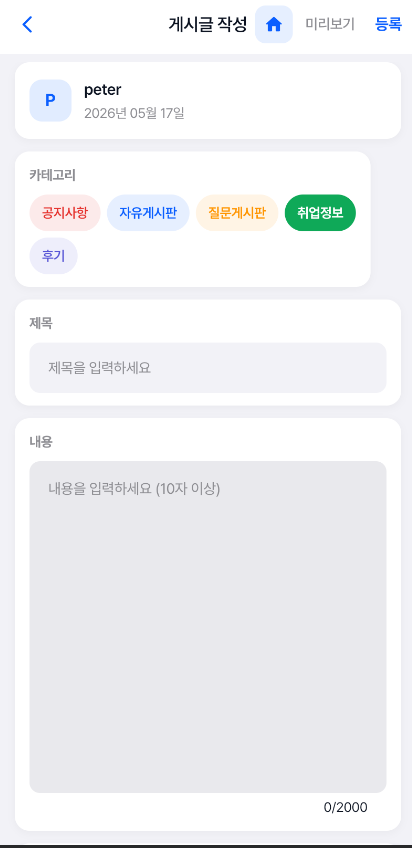<br/><sub>게시글 작성</sub></td>
    <td align="center">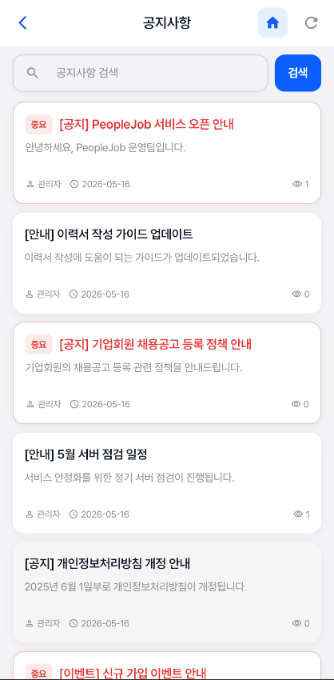<br/><sub>공지사항 목록</sub></td>
  </tr>
  <tr>
    <td align="center">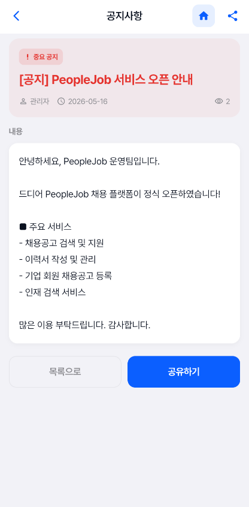<br/><sub>공지사항 상세 · 공유</sub></td>
    <td align="center">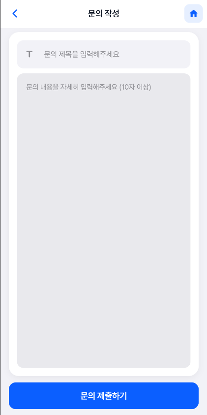<br/><sub>1:1 문의 작성</sub></td>
  </tr>
</table>

---

### 자료실 · 취업 뉴스 · 글자 수 세기

자료실에서는 자소서 작성 가이드, 채용 설명회 자료집, 면접 준비 체크리스트 등 취업 관련 자료를 제공하고, 글자 수 세기 도구와 취업 뉴스, 워크넷 바로가기를 통합 제공합니다. 취업 뉴스는 실시간 채용 트렌드와 정책 변화 정보를 목록 형태로 제공합니다.

<table>
  <tr>
    <td align="center">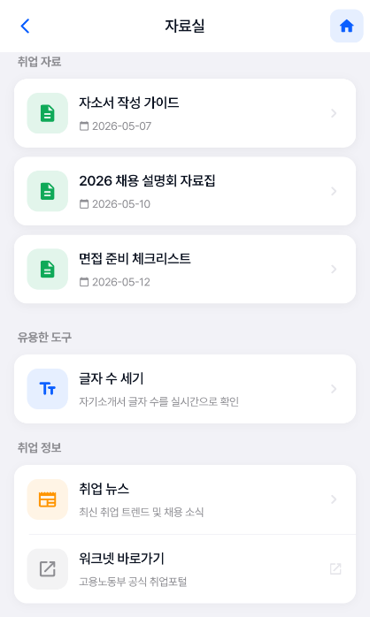<br/><sub>자료실 메인 — 자료·도구·뉴스</sub></td>
    <td align="center">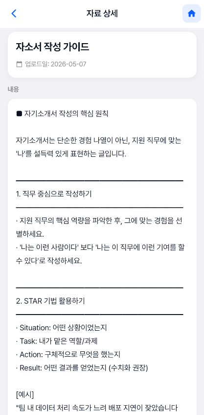<br/><sub>자료 상세 — 자소서 가이드</sub></td>
    <td align="center">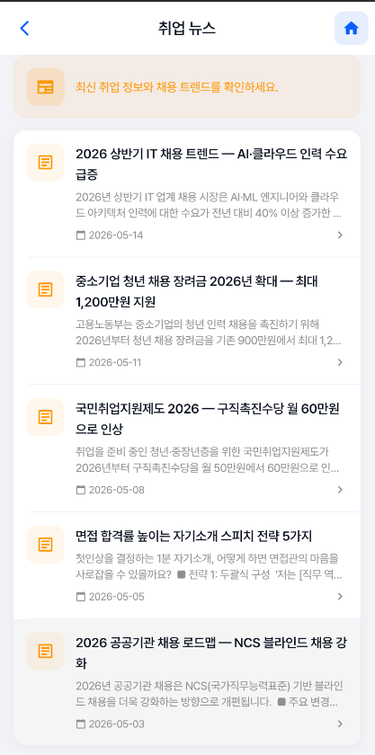<br/><sub>취업 뉴스</sub></td>
  </tr>
  <tr>
    <td align="center">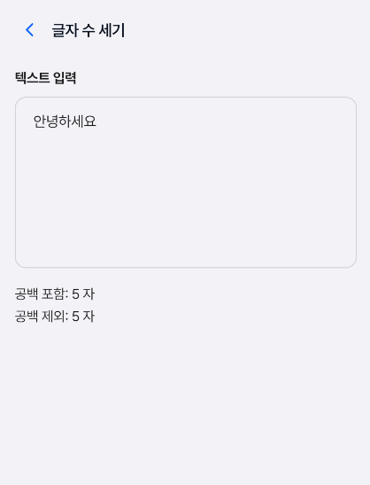<br/><sub>글자 수 세기 (공백 포함/제외)</sub></td>
  </tr>
</table>

---

### 관리자 패널

관리자 전용 패널로 회원·채용공고·지원자·광고결제·문의사항·공지사항·FAQ·팝업·파일·서비스 상품을 통합 관리합니다. 주요 목록에는 Excel 다운로드 버튼이 제공됩니다.

<table>
  <tr>
    <td align="center">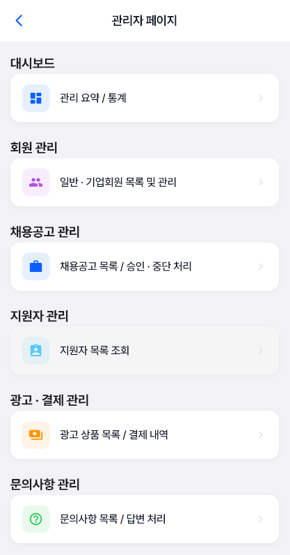<br/><sub>관리자 홈 — 전체 메뉴</sub></td>
    <td align="center">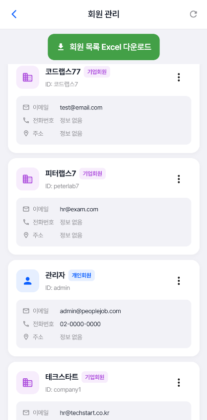<br/><sub>회원 관리 — 기업/개인 구분</sub></td>
    <td align="center">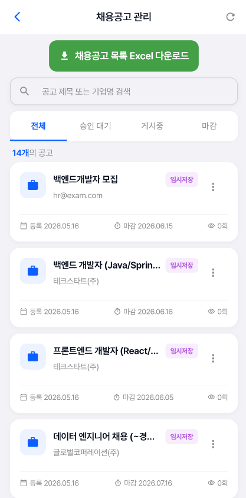<br/><sub>채용공고 관리 — 상태 탭 · 승인</sub></td>
  </tr>
  <tr>
    <td align="center">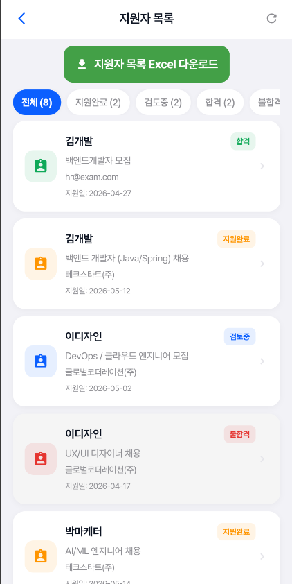<br/><sub>지원자 목록 — 상태별 필터</sub></td>
    <td align="center">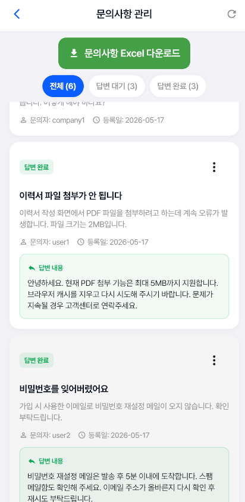<br/><sub>문의사항 관리 — 답변 처리</sub></td>
    <td align="center">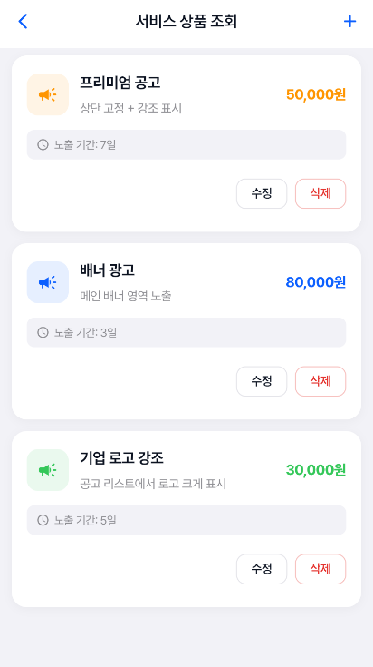<br/><sub>서비스 상품 조회 · 관리</sub></td>
  </tr>
  <tr>
    <td align="center">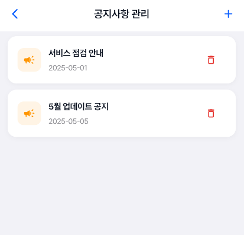<br/><sub>공지사항 관리</sub></td>
    <td align="center">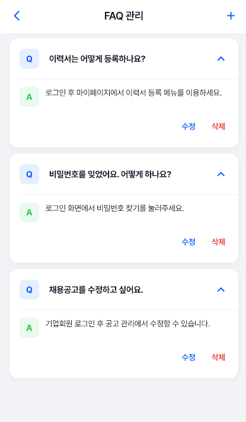<br/><sub>FAQ 관리 — 아코디언 Q&A</sub></td>
    <td align="center">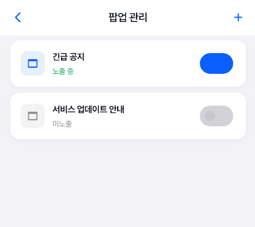<br/><sub>팝업 관리 — 노출 토글</sub></td>
  </tr>
  <tr>
    <td align="center">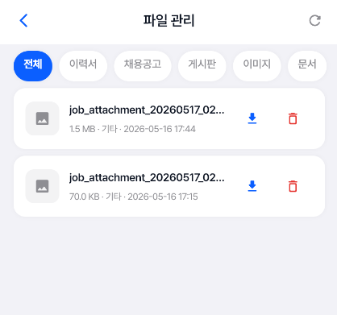<br/><sub>파일 관리 — 유형별 탭</sub></td>
    <td align="center">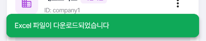<br/><sub>Excel 다운로드 완료 알림</sub></td>
  </tr>
</table>

<br>

---

## 주요 기능

### 구직자 (User)

| 기능 | 설명 |
|------|------|
| 회원가입 / 로그인 | 아이디·비밀번호 기반 인증, 이메일 인증 코드 확인 |
| 채용공고 탐색 | 전체 목록, 고용형태·지역 필터 칩, 키워드 검색, AD 배지 |
| 채용공고 지원 | 이력서 선택 후 원클릭 지원, 중복 지원 방지 |
| 이력서 관리 | 이력서 CRUD, 희망직종·지역·근무형태 선택, 프로필 사진 업로드 |
| 마이페이지 | 지원/스크랩/이력서 현황 통계, 내정보 수정, 비밀번호 변경 |
| 커뮤니티 | 게시판 카테고리별 읽기·쓰기·수정·삭제 |
| 자료실 | 취업 관련 자료 다운로드, 자소서 가이드, 면접 체크리스트 |
| 도구 | 글자 수 세기(공백 포함/제외), 취업 뉴스, 워크넷 바로가기 |
| 알림 | 실시간 알림 수신, 읽음 처리 |

### 기업 (Company)

| 기능 | 설명 |
|------|------|
| 채용공고 관리 | 등록·수정·삭제, 임시저장, 게시 상태 관리 — **본인 회사 공고만 조회·조작 가능** |
| 공고 상태 제어 | DRAFT → PENDING → PUBLISHED → EXPIRED 흐름 |
| 지원자 관리 | 공고별 지원자 목록, 이력서 열람, 이메일 연락 — **본인 회사 공고 지원자만 열람·상태 변경 가능** |
| 기업 마이페이지 | 기업 프로필 관리, 채용·서비스·계정 메뉴 통합 |
| 인재 검색 | 지역·직무 필터로 구직자 이력서 검색, 제안하기 |
| 광고 결제 | Basic·Standard·Premium 상품, 7일·14일·30일 노출 기간 선택 |
| 결제 내역 | 광고별 결제 금액·기간 이력, 총 결제 금액 요약 |

### 관리자 (Admin)

| 기능 | 설명 |
|------|------|
| 대시보드 | 사용자·공고·지원 현황 통계 |
| 회원 관리 | 기업/개인 회원 구분 조회·삭제, Excel 다운로드 |
| 채용공고 관리 | 전체/승인대기/게시중/마감 탭, 승인·반려·강제마감, Excel 다운로드 |
| 지원자 관리 | 전체 지원 내역, 상태(지원완료·검토중·합격·불합격) 필터, Excel 다운로드 |
| 문의사항 관리 | 답변 대기/완료 탭, 인라인 답변 처리, Excel 다운로드 |
| 공지사항 관리 | 공지 등록·수정·삭제 |
| FAQ 관리 | Q&A 아코디언 형식, 등록·수정·삭제 |
| 팝업 관리 | 팝업 배너 등록·수정, 노출/미노출 토글 |
| 파일 관리 | 이력서·채용공고·게시판·이미지·문서 유형별 탭, 다운로드·삭제 |
| 서비스 상품 관리 | 광고 상품(프리미엄·배너·로고 강조) 등록·수정·삭제 |

<br>

---

## 기술 스택

### 코어

| 분야 | 기술 | 버전 |
|------|------|------|
| UI 프레임워크 | Flutter | ≥ 3.7.2 |
| 상태 관리 | flutter_riverpod | 2.6.1 |
| HTTP 클라이언트 | Dio | 5.8.0+1 |
| HTTP 클라이언트 (보조) | http | 0.13.6 |
| 라우팅 | go_router | 15.1.0 (의존성 포함, 미사용 — MaterialApp.routes 사용) |
| 로컬 보안 저장소 | flutter_secure_storage | 9.0.0 |
| 로컬 설정 저장소 | shared_preferences | 2.2.2 |
| 로컬 DB | Hive + hive_flutter | 2.2.3 / 1.1.0 |
| 네트워크 상태 감지 | connectivity_plus | 5.0.1 |
| 로깅 | logger | 2.0.2 |

### UI / UX

| 분야 | 기술 | 버전 |
|------|------|------|
| 디자인 시스템 | Material Design 3 | — |
| 커스텀 폰트 | Pretendard | 400/500/600/700 |
| 커스텀 폰트 | Ownglyph-GeungJeong | — |
| 리치 텍스트 에디터 | flutter_quill + extensions | 11.4.0 / 11.0.0 |
| 이미지 캐싱 | cached_network_image | 3.3.0 |
| 아이콘 | cupertino_icons | 1.0.8 |
| 국제화 | intl | 0.20.2 |
| 웹뷰 | webview_flutter | 4.11.0 |

### 파일 처리

| 분야 | 기술 | 버전 |
|------|------|------|
| 파일 선택 | file_picker | 10.2.0 |
| 이미지 선택 | image_picker | 1.1.2 |
| 파일 경로 | path_provider | 2.1.1 |
| 권한 요청 | permission_handler | 11.1.0 |
| 암호화 | crypto + encrypt | 3.0.3 / 5.0.1 |
| URL 실행 | url_launcher | 6.3.1 |

### Firebase

| 서비스 | 패키지 | 버전 |
|--------|--------|------|
| Core | firebase_core | 3.13.0 |
| Auth | firebase_auth | 5.5.3 |
| Database | cloud_firestore | 5.6.7 |
| Storage | firebase_storage | 12.4.5 |

### 개발 / 테스트

| 분야 | 기술 | 버전 |
|------|------|------|
| 모킹 | mockito | 5.4.4 |
| 코드 생성 | build_runner | 2.4.9 |
| HTTP 모킹 | http_mock_adapter | 0.6.1 |
| 이미지 모킹 | network_image_mock | 2.1.1 |
| 테스트 데이터 | faker | 2.1.0 |
| 골든 테스트 | golden_toolkit | 0.15.0 |
| 코드 분석 | very_good_analysis | 6.0.0 |

<br>

---

## 아키텍처

```
┌─────────────────────────────────────────────────────┐
│                    UI Layer                         │
│  Pages (~60)   ·  Shared Widgets  ·  App Bar        │
└────────────────────────┬────────────────────────────┘
                         │ consumes
┌────────────────────────▼────────────────────────────┐
│              State Management Layer                 │
│         Riverpod Providers (StateProvider)          │
│   AuthProvider · JobProvider · NotifProvider · …   │
└────────────────────────┬────────────────────────────┘
                         │ calls
┌────────────────────────▼────────────────────────────┐
│                 Service Layer                       │
│  AuthService · JobService · ResumeService           │
│  ApplyService · BoardService · InquiryService       │
│  ScrapService · PaymentService · AdminService       │
│  MypageService · CacheService · …                   │
│  (JWT 인터셉터, 에러 처리, 페이지네이션 내장)         │
└──────────────┬─────────────────┬───────────────────┘
               │                 │
┌──────────────▼──────┐  ┌───────▼───────────────────┐
│   Remote API        │  │  Local Storage             │
│  REST (Dio/http)    │  │  SecureStorage (JWT)       │
│  JWT 인증           │  │  SharedPreferences         │
│  멀티파트 업로드     │  │  Hive (오프라인 캐시)       │
└─────────────────────┘  └───────────────────────────┘
```

### 라우팅

`MaterialApp.routes` + `onGenerateRoute`를 사용한 정적 라우트와 동적 라우트 혼합 방식입니다.  
`go_router` 패키지가 설치되어 있으나 실제 라우팅은 `MaterialApp.routes`로 처리합니다.

```
/                          → 홈
├─ /login                  → 로그인
├─ /register               → 회원가입
├─ /find-id                → 아이디 찾기
├─ /find-password          → 비밀번호 찾기
├─ /job-list               → 채용공고 목록
├─ /job-detail             → 채용공고 상세 (동적: jobId arguments)
├─ /job-register           → 채용공고 등록
├─ /job-edit               → 채용공고 수정 (동적: jobId arguments)
├─ /resume                 → 내 이력서 목록
├─ /resume-register        → 이력서 등록
├─ /resume-detail          → 이력서 상세 (동적)
├─ /resume-edit            → 이력서 수정 (동적)
├─ /apply-list             → 지원 내역
├─ /job-applications       → 공고별 지원자 목록 (동적)
├─ /profile-edit           → 내정보 수정
├─ /mypage                 → 개인 마이페이지
├─ /companymypage          → 기업 마이페이지
├─ /job-manage             → 기업 채용공고 관리
├─ /company-applicants     → 기업 지원자 관리
├─ /board                  → 게시판
├─ /board-write            → 게시글 작성
├─ /board-detail           → 게시글 상세 (동적)
├─ /board-edit             → 게시글 수정 (동적)
├─ /notice                 → 공지사항
├─ /notice-detail          → 공지사항 상세 (동적)
├─ /inquiry/list           → 1:1 문의 목록
├─ /inquiry/write          → 1:1 문의 작성
├─ /search                 → 통합 검색
├─ /talent-search          → 인재정보 검색
├─ /payment                → 광고 결제 메인
├─ /payment/target         → 광고 공고 선택
├─ /payment/product        → 광고 상품 선택
├─ /payment/schedule       → 광고 일정 설정
├─ /payment/result         → 결제 완료
├─ /payment/history        → 결제 내역
├─ /scrap                  → 스크랩 목록
├─ /resources/list         → 자료실
├─ /resources/news         → 취업 뉴스
├─ /tools/wordcount        → 글자 수 세기
├─ /settings/notifications → 알림 설정
├─ /unauthorized           → 권한 없음
└─ /admin/*                → 관리자 패널 (isAdminProvider 권한 체크)
    ├─ /admin              → 관리자 홈 (권한 체크 없음)
    ├─ /admin/dashboard    → 대시보드
    ├─ /admin/user         → 회원 관리
    ├─ /admin/jobs         → 채용공고 관리
    ├─ /admin/applicants   → 지원자 관리
    ├─ /admin/inquiry      → 문의사항 관리
    ├─ /admin/notice       → 공지사항 관리
    ├─ /admin/faq          → FAQ 관리
    ├─ /admin/popup        → 팝업 관리
    ├─ /admin/files        → 파일 관리
    ├─ /admin/products     → 서비스 상품 관리
    ├─ /admin/board/manage    → 게시판 관리
    ├─ /admin/board/register  → 게시판 등록
    ├─ /admin/board/edit/:id  → 게시판 수정 (동적)
    ├─ /admin/popup/manage    → 팝업 목록
    ├─ /admin/popup/register  → 팝업 등록
    └─ /admin/popup/edit/:id  → 팝업 수정 (동적)
```

관리자 라우트는 `isAdminProvider`로 접근 제어하며, 권한이 없으면 `UnauthorizedPage`로 리다이렉트합니다.

<br>

---

## 디렉토리 구조

```
lib/
├── main.dart                        # 앱 진입점, 초기화, 라우팅 정의
├── firebase_options.dart            # Firebase 설정
├── api_service.dart                 # 공통 API 서비스
│
├── config/
│   └── theme/
│       └── app_theme.dart           # 디자인 토큰, ThemeData
│
├── services/                        # 비즈니스 로직 계층
│   ├── auth_service.dart
│   ├── job_service.dart
│   ├── resume_service.dart
│   ├── apply_service.dart
│   ├── board_service.dart
│   ├── notice_service.dart
│   ├── inquiry_service.dart
│   ├── notification_service.dart
│   ├── scrap_service.dart
│   ├── payment_service.dart
│   ├── file_upload_service.dart
│   ├── admin_service.dart
│   ├── mypage_service.dart          # 마이페이지 전용 API
│   ├── cache_service.dart           # 메모리 캐시 (Redis 협력)
│   ├── email_service.dart
│   ├── email_verification_service.dart  # 이메일 인증 코드 처리
│   ├── password_reset_service.dart
│   ├── token_service.dart
│   ├── session_service.dart
│   └── config/
│       └── api_config.dart          # API 엔드포인트, 환경 설정
│
├── data/
│   ├── model/                       # 데이터 모델
│   │   ├── job.dart
│   │   ├── inquiry.dart
│   │   ├── board.dart
│   │   └── notification_model.dart
│   └── provider/                    # Riverpod 상태 관리
│       ├── auth_provider.dart
│       ├── job_provider.dart
│       ├── resume_providers.dart
│       ├── admin_provider.dart
│       ├── profile_provider.dart
│       ├── notification_provider.dart
│       ├── notice_provider.dart
│       ├── inquiry_provider.dart
│       └── file_upload_provider.dart
│
├── ui/
│   ├── pages/
│   │   ├── home/                    # 홈 화면
│   │   ├── login/                   # 인증 (로그인, 회원가입, 아이디/비번 찾기, 이메일 인증)
│   │   ├── job/                     # 채용공고
│   │   ├── resume/                  # 이력서
│   │   ├── board/                   # 게시판
│   │   ├── notice/                  # 공지사항
│   │   ├── inquiry/                 # 1:1 문의
│   │   ├── mypage/                  # 개인 마이페이지 (프로필 수정, 지원 내역, 스크랩)
│   │   ├── company_mypage/          # 기업 마이페이지
│   │   ├── company/                 # 기업 전용 (지원자 관리)
│   │   ├── search/                  # 검색, 인재정보 검색
│   │   ├── payment/                 # 광고 결제 플로우
│   │   ├── notification/            # 알림
│   │   ├── resources/               # 자료실, 취업 뉴스
│   │   ├── tools/                   # 글자 수 세기
│   │   ├── user/                    # 사용자 홈 (user_home_page.dart)
│   │   ├── admin/                   # 관리자 패널
│   │   │   ├── board/               # 게시판 CRUD (manage/register/edit)
│   │   │   └── popup/               # 팝업 CRUD (manage/register/edit)
│   │   └── error/                   # 오류 페이지 (unauthorized)
│   └── widgets/                     # 공유 위젯
│       ├── app_bar.dart             # 공통 AppBar + 로고 + 홈 버튼
│       ├── apply_dialog.dart
│       ├── job_status_change_button.dart
│       ├── quill_editor_widget.dart
│       └── …
│
├── core/
│   ├── constants/
│   ├── routes/
│   └── utils/
│
└── extension/                       # Dart 확장 메서드
```

<br>

---

## 서비스 레이어

### AuthService

인증·사용자 정보의 모든 흐름을 담당합니다.

```dart
login(userid, password)         // JWT 발급 및 SecureStorage 저장
register(...)                   // 개인/기업 회원가입 (25개 이상 필드)
verifyEmail(userid, code)       // 이메일 인증 코드 확인
checkUserid(userid)             // 아이디 중복 확인
getUserProfile()                // 현재 사용자 프로필 조회
updateUserProfile(...)          // 프로필 수정 (이름·이메일·전화번호·주소·기업정보)
changePassword(...)             // 비밀번호 변경
uploadProfileImage(file)        // 이미지 업로드 (Dio FormData)
deleteAccount()                 // 회원 탈퇴
logout()                        // 토큰 및 캐시 삭제
```

**토큰 관리:** Dio 인터셉터가 모든 요청에 `Authorization: Bearer <token>` 헤더를 자동으로 첨부합니다. 401 응답 시 토큰을 즉시 삭제합니다.

---

### JobService

채용공고 CRUD 및 상태 흐름 관리.

```dart
getAllJobs({size})               // 게시된 공고 목록 (페이지네이션)
getJobDetail(jobId)             // 공고 상세
createJob(jobData)              // 공고 등록
updateJob(jobId, jobData)       // 공고 수정
deleteJob(jobId)                // 공고 삭제
searchJobs(keyword)             // 키워드 검색
saveDraft(jobData)              // 임시 저장
publishJob(jobNo, userNo)       // 임시저장 → 게시 신청
changeJobStatus(...)            // 상태 변경 (PUBLISHED / EXPIRED / ...)
expireOverdueJobs()             // 마감된 공고 일괄 처리
batchChangeStatus(...)          // 일괄 상태 변경 (관리자)
batchDeleteJobs(jobNos)         // 일괄 삭제 (관리자)
```

**공고 상태 흐름:**

```
DRAFT ──► PENDING ──► PUBLISHED ──► EXPIRED
  │                      │
  └──────────────────────┘  (수정 후 재심사)
```

---

### ResumeService

이력서 CRUD와 첨부파일 처리.

```dart
getUserResumes(userNo)          // 사용자별 이력서 목록 (본인 이력서만)
getAllResumes()                  // 전체 이력서 조회 (인재검색용)
getResumeDetail(resumeId)       // 이력서 상세 (Quill Delta 포함)
createResume(resumeData)        // 이력서 등록 → resumeId 반환
updateResume(resumeId, data)    // 이력서 수정
deleteResume(resumeId)          // 이력서 삭제
searchResumes(keyword)          // 키워드 검색
getResumesByJobType(jobType)    // 직종별 조회
```

테스트용 `setTestOverrides(dio, storage)`로 Mock Dio/Storage를 주입할 수 있습니다.

---

### ApplyService

지원 처리와 상태 추적.

```dart
applyToJob(jobNo, resumeNo)         // 공고 지원 (400: 중복 지원 방지)
cancelApplication(applyNo)          // 지원 취소
getMyApplications()                 // 내 지원 목록
getApplicationsByJob(jobNo)         // 공고별 지원자 목록 (기업용)
updateApplicationStatus(...)        // 지원 상태 변경 (기업용)
hasAppliedToJob(jobNo)              // 특정 공고 지원 여부 확인
```

---

### MypageService

마이페이지 전용 API. 백엔드 `MypageController`와 1:1 연동합니다.

```dart
getMyProfile()                  // 내 프로필 조회
updateMyProfile(data)           // 프로필 수정
getMyStats()                    // 지원/스크랩/이력서 통계
```

JWT 인터셉터를 내장하며 401 응답 시 토큰을 자동으로 삭제합니다.

---

### CacheService

Redis 백엔드와 협력하는 클라이언트 사이드 인메모리 캐시 서비스입니다. 앱 세션 동안 API 응답을 캐싱하여 불필요한 네트워크 요청을 줄입니다.

```dart
get<T>(key)                         // 캐시 조회 (만료 시 null 반환)
set(key, value, {duration})         // 캐시 저장 (기본 10분)
remove(key)                         // 특정 키 삭제
clear()                             // 전체 캐시 초기화
```

| 캐시 TTL 상수 | 값 |
|------|------|
| `defaultCacheDuration` | 10분 |
| `shortCacheDuration` | 5분 |
| `longCacheDuration` | 1시간 |

---

### EmailVerificationService

회원가입 시 이메일 인증 코드 발송 및 검증을 처리합니다.

```dart
sendVerificationCode(email)     // 인증 코드 발송
verifyCode(email, code)         // 코드 확인 → bool 반환
```

---

### AdminNotifier (Riverpod StateNotifier)

관리자 기능 전체를 하나의 StateNotifier로 통합 관리합니다.

```dart
loadDashboard()                 // 통계 데이터 조회
loadUsers() / deleteUser()      // 회원 관리
loadJobs() / deleteJob()        // 채용공고 목록·삭제
approveJob(jobNo)               // 공고 승인 (PENDING → PUBLISHED)
rejectJob(jobNo)                // 공고 반려 (PENDING → DRAFT)
expireJob(jobNo)                // 공고 강제 마감 (PUBLISHED → EXPIRED)
loadApplicants()                // 전체 지원자 조회
loadInquiries() / answerInquiry() / deleteInquiry()  // 문의사항 관리
loadPayments()                  // 결제 내역 조회
downloadUsersExcel()            // 회원 목록 Excel 다운로드
downloadJobsExcel()             // 채용공고 Excel 다운로드
downloadApplicantsExcel(jobNo)  // 지원자 목록 Excel 다운로드
downloadInquiriesExcel()        // 문의사항 Excel 다운로드
downloadPaymentsExcel()         // 결제 내역 Excel 다운로드
```

---

### 기타 서비스 요약

| 서비스 | 주요 기능 |
|--------|-----------|
| **BoardService** | 게시판 CRUD, 카테고리 필터, 검색, 조회수 증가 |
| **NoticeService** | 공지사항 조회, 중요 공지 구분, 페이지네이션 |
| **InquiryService** | 문의 작성, 조회, 관리자 답변 등록 |
| **NotificationService** | 알림 목록, 읽지 않은 알림 수, 읽음 처리 |
| **ScrapService** | 공고 스크랩 추가/삭제/목록 |
| **FileUploadService** | 이미지·파일 선택, 업로드 (Dio FormData), Excel 다운로드 |
| **PasswordResetService** | 비밀번호 재설정 이메일 발송 |
| **EmailService** | 이메일 발송 (일반 용도) |
| **TokenService** | JWT 저장·조회·삭제 (SecureStorage 래퍼) |
| **SessionService** | 로그인 세션 상태 관리 |

<br>

---

## 상태 관리

Riverpod의 `StateProvider` / `StateNotifier` 패턴을 사용합니다.

### 핵심 Provider

```dart
// 관리자 여부 (라우팅 권한 제어)
final isAdminProvider = StateProvider<bool>((ref) => false);

// 채용공고 상태
final jobProvider = StateNotifierProvider<JobNotifier, JobState>(...);
// JobState: jobs, filteredJobs, isLoading, error, currentPage, ...

// 프로필 수정
final profileProvider = StateNotifierProvider<ProfileNotifier, ProfileState>(...);
// ProfileState: userProfile, isLoading, error, selectedImage

// 관리자 상태 (회원/공고/지원자/결제/문의 통합)
final adminProvider = StateNotifierProvider<AdminNotifier, AdminState>(...);

// 알림
final notificationProvider = ChangeNotifierProvider<NotificationProvider>(...);

// 공지사항
final noticeProvider = StateNotifierProvider<NoticeNotifier, NoticeState>(...);

// 문의사항
final inquiryProvider = StateNotifierProvider<InquiryNotifier, InquiryState>(...);

// 파일 업로드
final fileUploadProvider = StateNotifierProvider<FileUploadNotifier, FileUploadState>(...);

// 이력서 폼 필드 (세분화된 StateProvider)
final resumeTitleProvider       = StateProvider<String>((ref) => '');
final resumeDescriptionProvider = StateProvider<String?>((ref) => null);
final resumeAddressProvider     = StateProvider<String>((ref) => '');
final resumeImageProvider       = StateProvider<File?>((ref) => null);
```

### 데이터 흐름

```
사용자 액션
    │
    ▼
ConsumerWidget (UI)
    │ ref.watch(provider)
    ▼
StateNotifier / StateProvider
    │ calls
    ▼
Service (비즈니스 로직)
    │ HTTP request
    ▼
REST API
```

<br>

---

## 디자인 시스템

`AppTheme` 클래스에 모든 디자인 토큰을 정의합니다.

### 색상 팔레트

| 팔레트 | 토큰 | 값 | 용도 |
|--------|------|----|------|
| **Sapphire** | `sapphire500` | `#0B5FFF` | 브랜드 프라이머리 |
| | `sapphire300` | `#5A99FF` | 호버, 포커스 링 |
| | `sapphire50` | `#E8F0FF` | 배경 강조 |
| **Obsidian** | `ink900` | `#0B1220` | 헤드라인 |
| | `ink700` | `#1C1C1E` | 본문 |
| | `ink300` | `#8E8E93` | 보조 텍스트 |
| | `ink50` | `#F2F2F7` | 페이지 배경 |
| **Champagne** | `champagne500` | `#C8A96A` | 프리미엄 강조 |
| **Semantic** | `success` | `#0FA958` | 성공 |
| | `warning` | `#E89500` | 경고 |
| | `danger` | `#E5342F` | 오류 |

### 타이포그래피

Pretendard 폰트 기반 7단계 역할 스케일:

| 역할 | TextTheme 키 | 크기 | 굵기 | 용도 |
|------|-------------|------|------|------|
| Display | `displayLarge` | 32 | 700 | 히어로 헤딩 |
| H1 | `headlineLarge` | 24 | 700 | 섹션 헤더 |
| H2 | `headlineMedium` | 20 | 700 | 서브 섹션 |
| Title | `titleLarge` | 17 | 600 | 카드 제목, 앱바 |
| Body | `bodyMedium` | 15 | 400 | 본문 |
| Caption | `bodySmall` | 13 | 400 | 보조 설명 |
| Micro | `labelSmall` | 11 | 600 | 배지, 태그 |

Ownglyph-GeungJeong 폰트는 홈 화면 슬로건 등 감성적 표현이 필요한 곳에 선택적으로 사용합니다.

### 그림자 시스템

```dart
AppTheme.shadowXs    // blur: 4,  y: 1  — 미세 구분선
AppTheme.shadowSm    // blur: 8,  y: 2  — 카드
AppTheme.shadowMd    // blur: 16, y: 4  — 모달
AppTheme.shadowLg    // blur: 24, y: 8  — 드롭다운
AppTheme.shadowBrand // blur: 28, y: 10 — CTA 버튼 (브랜드 색상)
```

### Border Radius

```dart
radiusSm  = 8    // 입력 필드, 칩
radiusMd  = 12   // 카드, 버튼
radiusLg  = 16   // 큰 카드
radiusXl  = 20   // 시트
radius2xl = 28   // 다이얼로그
radiusFull = 999 // 원형 버튼, 아바타
```

### 공통 AppBar

```dart
buildCommonAppBar(
  title: '페이지 제목',
  showBackButton: true,   // arrow_back_ios_rounded, 사파이어 컬러
  showHomeButton: true,   // 홈 버튼 (우측 상단)
  onBack: () => ...,      // 커스텀 뒤로가기 동작 (옵션)
  actions: [...],
)
```

<br>

---

## API 연동

환경별 API 엔드포인트는 `flutter_dotenv`를 사용해 `.env` 파일로 분리 관리합니다.

### 필수 환경 변수 (.env)

```env
API_URL=http://localhost:5000

FIREBASE_API_KEY=your-api-key
FIREBASE_AUTH_DOMAIN=your-project.firebaseapp.com
FIREBASE_PROJECT_ID=your-project-id
FIREBASE_STORAGE_BUCKET=your-project.appspot.com
FIREBASE_MESSAGING_SENDER_ID=000000000000
FIREBASE_APP_ID=1:000000000000:web:000000000000
```

> Android/iOS는 `google-services.json` / `GoogleService-Info.plist`로 Firebase를 초기화합니다. Web은 `.env` 값으로 수동 초기화합니다.

### API 설정값

| 항목 | 값 |
|------|----|
| 연결 타임아웃 | 30초 |
| 응답 타임아웃 | 30초 |
| 재시도 횟수 | 3회 |
| 페이지 기본 크기 | 20개 |
| 최대 페이지 크기 | 100개 |
| 파일 최대 크기 | 20 MB |
| 지원 이미지 형식 | jpg, jpeg, png, gif, webp |
| 지원 문서 형식 | pdf, doc, docx, hwp |

### 인증 헤더

```dart
// 모든 인증 요청에 자동 적용
ApiConfig.getAuthHeaders(token)
// → {'Authorization': 'Bearer $token', 'Content-Type': 'application/json', ...}

// 파일 업로드
ApiConfig.getMultipartAuthHeaders(token)
// → {'Authorization': 'Bearer $token', 'Content-Type': 'multipart/form-data', ...}
```

### 페이지네이션 응답 구조

```json
{
  "content": [...],
  "totalElements": 100,
  "totalPages": 5,
  "number": 0,
  "last": false
}
```

<br>

---

## 테스트

### 테스트 구조

```
test/
├── auth_service_test.dart       # 인증 서비스 단위 테스트
├── board_service_test.dart      # 게시판 서비스 단위 테스트
├── resume_service_test.dart     # 이력서 서비스 단위 테스트
├── notice_service_test.dart     # 공지사항 서비스 단위 테스트
├── apply_service_test.dart      # 지원 서비스 단위 테스트
├── test_mocks.dart              # @GenerateMocks 선언 (build_runner 입력)
├── test_mocks.mocks.dart        # Mockito 자동 생성 Mock 클래스
├── widget_tests/
│   ├── login_page_test.dart     # 로그인 페이지 위젯 테스트
│   ├── job_list_page_test.dart  # 채용공고 목록 위젯 테스트
│   └── widget_test.dart         # MaterialApp 기본 렌더링 스모크 테스트
├── integration_tests/
│   └── app_integration_test.dart  # 통합 테스트 (기기/Firebase 필요 — skip)
└── performance/
    └── performance_test.dart    # 스크롤 성능 유틸리티 클래스
```

### 테스트 실행

```bash
# 전체 단위 + 위젯 테스트 (통합 테스트 자동 skip)
flutter test

# 서비스 단위 테스트만
flutter test test/auth_service_test.dart test/apply_service_test.dart ...

# 위젯 테스트만
flutter test test/widget_tests/

# 통합 테스트 (기기/에뮬레이터 + Firebase 필요)
flutter test integration_test/ --device-id=<device-id>

# 커버리지 리포트 생성
flutter test --coverage
```

### 테스트 전략

- **단위 테스트:** `@GenerateMocks` + `build_runner`로 생성한 타입 안전 Mock 클래스 사용. `MockDio`, `MockFlutterSecureStorage`, `MockClient`를 의존성 주입해 HTTP 계층을 완전히 대체.
- **위젯 테스트:** `flutter_test`로 UI 렌더링 및 사용자 인터랙션 검증. `dotenv.testLoad()`로 환경 변수 초기화, `network_image_mock`으로 이미지 로딩 대체.
- **통합 테스트:** `integration_test` 패키지 기반 전체 앱 플로우 시나리오. Firebase + 실제 기기가 필요하므로 일반 `flutter test`에서는 `skip: true`로 건너뜀.
- **테스트 훅:** `ResumeService.setTestOverrides()`, `BoardService.setTestOverrides()`로 Mock DI 지원.

### 프론트엔드 테스트 결과

```
flutter test 실행 기준 (2025-05-20)

+82 ~10: All tests passed!
  82개 통과 | 10개 skip (integration — 기기 필요) | 0개 실패
```

| 테스트 파일 | 케이스 수 | 결과 |
|------------|-----------|------|
| `auth_service_test.dart` | 12 | ✅ 전체 통과 |
| `apply_service_test.dart` | 14 | ✅ 전체 통과 |
| `board_service_test.dart` | 17 | ✅ 전체 통과 |
| `resume_service_test.dart` | 17 | ✅ 전체 통과 |
| `notice_service_test.dart` | 6 | ✅ 전체 통과 |
| `widget_tests/login_page_test.dart` | 7 | ✅ 전체 통과 |
| `widget_tests/job_list_page_test.dart` | 3 | ✅ 전체 통과 |
| `widget_tests/widget_test.dart` | 1 | ✅ 통과 |
| `integration_tests/app_integration_test.dart` | 10 | ⏭ skip |

### 프론트엔드 테스트 개선 과정

초기 `flutter test` 실행 시 모든 테스트가 오류로 종료되었습니다. 아래 4단계를 거쳐 82 pass / 0 fail 상태로 개선했습니다.

#### 1단계 — Mockito null-safety 문제 해결 (핵심)

**증상:** `type 'Null' is not a subtype of type 'Interceptors'` / `Bad state: Cannot call 'when' within a stub response`

**원인:** `extends Mock implements Dio {}` 방식의 수동 Mock은 Mockito 5(null-safe) 환경에서 `Interceptors` 같은 non-nullable 반환 타입을 처리하지 못함. 첫 번째 `when()` 실패가 Mockito 내부 `_whenInProgress` 상태를 오염시켜 이후 모든 `when()` 호출이 연쇄 실패.

**해결:** `test/test_mocks.dart`에 `@GenerateMocks([Dio, FlutterSecureStorage, http.Client])` 선언 후 `dart run build_runner build`로 코드 생성. 생성된 `MockDio`는 `_FakeInterceptors_3` 등 적절한 fake 반환값을 내장해 null-safety 문제를 원천 차단.

```dart
// test/test_mocks.dart
@GenerateMocks([Dio, FlutterSecureStorage, http.Client])
void main() {}
```

#### 2단계 — 테스트 URL / 검색 queryParameters 불일치 수정

**증상:** `apply_service_test.dart`, `board_service_test.dart`, `resume_service_test.dart`에서 `verify()` 실패

**원인:**
- apply: API 경로가 `/api/apply/user/1` → 실제 서비스는 `/api/mypage/applies/1`로 변경됨
- board/resume: 검색 URL을 `'/api/board/search?keyword=$keyword'`(쿼리 포함 문자열)로 모킹했지만, Dio는 path와 queryParameters를 분리해서 처리

**해결:**
- apply 경로를 실제 서비스 경로로 수정
- 검색 mock을 `mockDio.get('/api/board/search', queryParameters: anyNamed('queryParameters'))`로 변경

#### 3단계 — 한글 포함 HTTP 응답 인코딩 오류 수정

**증상:** `auth_service_test.dart`에서 `ArgumentError: Contains invalid characters`

**원인:** `http.Response('{"name":"홍길동"}', 200)` 생성자는 문자열을 Latin-1로 인코딩. 한국어가 Latin-1 범위를 벗어나 예외 발생.

**해결:** `http.Response.bytes(utf8.encode(jsonEncode(body)), 200)`으로 교체.

#### 4단계 — 위젯 테스트 인프라 수정

| 문제 | 원인 | 해결 |
|------|------|------|
| `NotInitializedError` (job_list, login) | 위젯 생성 시 `dotenv.env`를 바로 호출하는데 dotenv 미초기화 | `setUpAll`에서 `dotenv.testLoad(fileInput: 'API_URL=...')` 호출 |
| 버튼 off-screen 오류 (login) | 기본 800×600 캔버스에 스크롤 폼이 잘려 ElevatedButton 위치가 y=613 초과 | `tester.ensureVisible()`로 버튼 스크롤 후 탭 |
| Pending timer 오류 (job_list) | Dio connectTimeout(10초) 타이머가 fake async에 미결로 남아 테스트 종료 실패 | `await tester.pump(const Duration(seconds: 11))`로 fake time을 타임아웃 이후로 진행 |
| 로딩 인디케이터 타이밍 (login) | `TestWidgetsFlutterBinding`이 HTTP를 즉시 400으로 처리해 `pump()` 한 번 안에 로딩→완료 전환 | CircularProgressIndicator 타이밍 의존 검증 제거, 완료 상태 검증으로 변경 |
| AppBar 없는 페이지에서 AppBar 검색 | 커스텀 레이아웃으로 리디자인되어 AppBar 제거됨 | `find.byType(TextFormField).at(0/1)` 인덱스 기반 탐색으로 교체 |
| 통합 테스트 Firebase 오류 | `IntegrationTestWidgetsFlutterBinding` + `Firebase.initializeApp()` → 기기 없이 실행 불가 | 모든 `testWidgets`에 `skip: true` 추가, 문서에 실행 방법 명시 |
| `performance_test.dart` 컴파일 오류 | 유틸리티 클래스 파일인데 `main()` 함수 없음 | 파일 하단에 `void main() {}` 추가 |
| 위젯 테스트 boilerplate 오류 | `widget_test.dart`가 존재하지 않는 Counter 앱 위젯 테스트 | 간단한 `MaterialApp` 스모크 테스트로 교체 |

### 백엔드 테스트 커버리지 (JaCoCo)

Spring Boot 백엔드는 `.\mvnw.cmd test`로 테스트를 실행하고 JaCoCo로 커버리지를 측정합니다.

#### 개선 전 → 개선 후

| 항목 | 개선 전 | 개선 후 |
|------|--------|--------|
| 총 테스트 수 | 272개 | **342개** (+70) |
| 실패/오류 | 35개 | **0개** |
| Instruction 커버리지 | 30% | **54%** |
| Branch 커버리지 | 23% | **40%** |
| 측정 대상 클래스 | 94개 | 59개 (인프라 제외) |

#### 개선 후 패키지별 커버리지

| 레이어 | 패키지 | 커버리지 |
|--------|--------|---------|
| 사용자 컨트롤러 | `user.controller` | **92%** |
| 이메일 서비스 | `email.service` | **100%** |
| 문의 서비스 | `inquiry.service` | **100%** |
| 마이페이지 서비스 | `mypage.service` | **100%** |
| 관리자 컨트롤러 | `admin.controller` | **90%** |
| 게시판 서비스 | `board.service` | **87%** |
| 채용공고 서비스 | `job.service` | **71%** |
| **전체 (59클래스)** | — | **54%** |

#### 개선 과정 요약

1. **실패 테스트 수정** — Spring Security 미설정(`@WithMockUser` 누락), `@Value` 미주입(NPE), `ApiResponse` 래퍼 구조 불일치 등 35개 오류 해결
2. **프로덕션 버그 수정** — `validatePassword()` 미호출, Null 검증 누락, `FileService` 인터페이스 미정의, 캐스팅 오류 등 실제 버그 수정
3. **JaCoCo 인프라 제외** — `config`, `cache`, `ratelimit`, `scheduler`, `notification` 등 비즈니스 로직 없는 인프라 패키지를 측정 대상에서 제외 (94 → 59클래스)
4. **신규 테스트 추가 +70개** — `InquiryServiceTest`(10), `MypageServiceTest`(7), `FileServiceTest`(13), `EmailVerificationControllerTest`(14), `PasswordResetControllerTest`(13), `UserControllerTest` 추가(9)

> 인프라·설정 클래스를 제외한 핵심 비즈니스 로직 기준으로 Instruction 54%, Branch 40%를 달성했습니다.

<br>

---

## 빌드 및 배포

### 개발 환경 설정

```bash
# 의존성 설치
flutter pub get

# 코드 생성 (Mockito Mock 클래스)
dart run build_runner build --delete-conflicting-outputs

# 개발 서버 실행
flutter run
```

### 빌드 명령

```bash
# 웹 프로덕션 빌드
flutter build web --release

# Android APK
flutter build apk --release

# Android App Bundle (Play Store)
flutter build appbundle --release

# 코드 품질 검사
flutter analyze
dart format .
```

### Android 권한

```xml
<!-- 미디어 접근 (Android 13+) -->
<uses-permission android:name="android.permission.READ_MEDIA_IMAGES" />
<uses-permission android:name="android.permission.READ_MEDIA_VIDEO" />
<!-- 저장소 접근 (Android ≤ 12) -->
<uses-permission android:name="android.permission.READ_EXTERNAL_STORAGE" />
<uses-permission android:name="android.permission.WRITE_EXTERNAL_STORAGE" />
<!-- 네트워크 -->
<uses-permission android:name="android.permission.INTERNET" />
```

### CI/CD

GitHub Actions(`.github/workflows/frontend-ci.yml`)로 `main`·`develop` 브랜치 push 및 `main` PR 시 자동 파이프라인이 실행됩니다.

| 단계 | 내용 |
|------|------|
| Checkout | 코드 체크아웃 |
| Flutter 설정 | stable 채널, 캐시 활성화 |
| .env 생성 | CI용 더미 환경 변수 주입 |
| 의존성 설치 | `flutter pub get` |
| 정적 분석 | `flutter analyze --no-fatal-infos` |
| 테스트 실행 | 위젯 + 서비스 단위 테스트 (auth, board, resume, apply, notice) |

<br>

---

## 실행 방법

```bash
git clone <repository-url>
cd peoplejob_frontend

# 1. 의존성 설치
flutter pub get

# 2. .env 파일 생성 (필수)
cp .env.example .env
# → API_URL=http://localhost:5000, FIREBASE_* 값 입력

# 3. Mock 코드 생성
dart run build_runner build --delete-conflicting-outputs

# 4. 실행
flutter run
```

> **참고:** Android/iOS 빌드 시 `google-services.json`(Android) / `GoogleService-Info.plist`(iOS)가 필요합니다. 저장소에는 포함되지 않으므로 Firebase 콘솔에서 별도로 발급받으세요.

<br>

---

## 트러블슈팅

### `.env` 파일을 찾을 수 없음

```
FileNotFoundException: .env file not found
```

프로젝트 루트에 `.env` 파일이 없거나 `pubspec.yaml`의 `assets`에 등록되지 않은 경우입니다.

```bash
# 루트에 .env 파일 생성
touch .env
```

`pubspec.yaml`에 다음이 있는지 확인하세요.

```yaml
flutter:
  assets:
    - .env
```

---

### Firebase 초기화 오류 (중복 초기화)

```
[core/duplicate-app] A Firebase App named '[DEFAULT]' already exists.
```

`main.dart`에서 Firebase를 두 번 초기화하고 있을 때 발생합니다. Web은 `FirebaseOptions` 수동 전달, Android/iOS는 `Firebase.initializeApp()` 단독 호출만 허용합니다. 두 경로가 `kIsWeb`으로 분기되어 있는지 확인하세요.

---

### 401 Unauthorized — JWT 토큰 만료

모든 서비스의 Dio 인터셉터는 401 응답 시 `SecureStorage`에서 토큰을 자동 삭제합니다. 로그아웃 후 재로그인하면 해결됩니다. 토큰이 삭제됐는데도 반복 발생하면 백엔드 토큰 유효 기간 설정을 확인하세요.

---

### `flutter pub get` 실패 — 의존성 충돌

```
Because X depends on Y >=A <B which doesn't match any versions, version solving failed.
```

Flutter SDK 버전이 `^3.7.2`보다 낮거나, Dart SDK가 `^3.7.2`와 맞지 않을 때 발생합니다.

```bash
flutter upgrade          # Flutter SDK 최신화
flutter pub upgrade      # 패키지 버전 업데이트
```

---

### build_runner — Mock 코드 생성 실패

```
[SEVERE] Failed to generate code for ...
```

기존 생성 파일과 충돌이 발생했을 때입니다.

```bash
dart run build_runner clean
dart run build_runner build --delete-conflicting-outputs
```

---

### 웹 빌드 CORS 오류

```
Access to XMLHttpRequest blocked by CORS policy
```

Flutter Web에서 백엔드 API를 직접 호출할 때 발생합니다. 백엔드 서버에서 `Access-Control-Allow-Origin` 헤더를 허용하거나, 개발 중에는 `flutter run -d chrome --web-browser-flag "--disable-web-security"` 옵션을 임시로 사용할 수 있습니다. 운영 환경에서는 반드시 서버 측 CORS 설정으로 해결하세요.

---

### 파일 선택/이미지 선택 미동작 (Android)

`file_picker`와 `image_picker`는 Android 13+ 에서 미디어 권한이 필요합니다. `permission_handler`로 런타임 권한을 요청하고, `AndroidManifest.xml`에 `READ_MEDIA_IMAGES` 권한이 선언되어 있는지 확인하세요.

---

### Hive 초기화 오류

```
HiveError: You need to initialize Hive or pass a path to Hive.init()
```

앱 진입점(`main.dart`)의 `WidgetsFlutterBinding.ensureInitialized()` 이후에 `Hive.initFlutter()`가 호출되어야 합니다. 현재 코드에서 Hive를 직접 사용하는 서비스가 있다면 초기화 순서를 확인하세요.

---

### 관리자 페이지 접근 불가 — `UnauthorizedPage`로 리다이렉트

`/admin/*` 라우트는 `isAdminProvider`가 `true`일 때만 접근됩니다. 로그인 후 `isAdminProvider`를 `true`로 설정하는 로직(보통 `AuthService.login()` 응답의 `role` 필드 확인)이 실행됐는지 확인하세요.

---

### Dio 타임아웃

```
DioException [connect timeout]: ...
```

`ApiConfig`의 기본 타임아웃은 30초입니다. 백엔드 서버가 실행 중인지, `.env`의 `API_URL`이 올바른지 확인하세요. 에뮬레이터에서 로컬 서버에 접근할 때는 `10.0.2.2`(Android 에뮬레이터) 또는 실제 머신 IP를 사용해야 합니다.

```env
# Android 에뮬레이터에서 로컬 서버 접근 시
API_URL=http://10.0.2.2:5000
```

---

### 이미지 로딩 실패 (`cached_network_image`)

서버에서 이미지 URL이 만료됐거나, Firebase Storage 규칙이 비공개로 설정된 경우입니다. Firebase Storage 규칙을 확인하거나, 이미지 URL에 서명된 토큰이 포함되어 있는지 확인하세요.

---

### 골든 테스트 실패

```
Golden "xxx.png": Pixel test failed, X pixels are not matching.
```

UI 변경 후 골든 파일이 갱신되지 않았을 때 발생합니다.

```bash
flutter test --update-goldens
```

`test/golden_files/` 디렉토리의 `.png` 파일이 갱신됩니다. 의도한 UI 변경이 맞는지 확인 후 커밋하세요.

---

### 기업 채용공고·지원자 관리 — 타사 데이터 접근 차단

**증상:** 기업 마이페이지의 채용공고 관리·지원자 관리에서 본인 회사 데이터만 보여야 하는데, URL에 다른 `userNo`나 `jobNo`를 넣으면 타사 공고 목록 조회·수정·삭제 및 타사 지원자 목록 열람이 가능한 상태였음.

**원인:** 백엔드가 클라이언트가 전달한 `userNo`를 그대로 신뢰하고, `update` / `delete` / `getByJob` / `updateStatus` 엔드포인트에 소유권 검증 로직이 없었음.

**해결:**

1. **채용공고 조회** — `GET /api/jobs/user/{userNo}` (URL 파라미터 신뢰) → `GET /api/jobs/user/my` 로 변경. 컨트롤러에서 `Authorization` 헤더의 JWT를 직접 파싱해 `userNo`를 추출하므로 클라이언트 조작 불가.

2. **채용공고 수정·삭제·게시·상태변경** — 서비스 레이어에 소유권 검증 추가. `entity.getUserNo().equals(userNo)` 불일치 시 `RuntimeException("권한이 없습니다.")` 발생.

3. **지원자 목록 조회** (`GET /api/apply/job/{jobopeningNo}`) — JWT로 추출한 `userNo`가 해당 공고의 `userNo`와 일치해야만 반환. 불일치 시 403.

4. **지원자 상태 변경** (`PUT /api/apply/{applyNo}/status`) — 지원 건의 `jobNo`로 공고를 조회한 뒤, 공고 owner와 JWT `userNo`를 비교해 권한 검증.

```java
// JobopeningController — JWT에서 userNo 추출
private Long extractUserNo(HttpServletRequest request) {
    String auth = request.getHeader("Authorization");
    String userid = jwtTokenProvider.getUserid(auth.substring(7));
    return userRepository.findByUserid(userid)
            .orElseThrow(() -> new RuntimeException("사용자를 찾을 수 없습니다."))
            .getUserNo();
}

// JobopeningServiceImpl — 수정/삭제 소유권 검증
if (!entity.getUserNo().equals(userNo)) {
    throw new RuntimeException("권한이 없습니다.");
}

// ApplyController — 지원자 조회 소유권 검증
Long jobOwner = jobopeningRepository.findById(jobopeningNo).getUserNo();
if (!jobOwner.equals(userNo)) {
    return ResponseEntity.status(403).body(ApiResponse.error("권한이 없습니다."));
}
```

---

### 알림 폴링 — `while(true)` 무한루프로 인한 메모리 누수

**증상:** 로그아웃 후에도 알림 폴링이 계속 동작하며 30초마다 API 요청이 발생. 백엔드가 꺼진 상태에서도 루프가 종료되지 않음.

**원인:** `NotificationService.startPolling()`이 `while(true)` + `Future.delayed` 조합으로 구현되어 있었음. `await Future.delayed` 중에는 루프를 외부에서 중단할 수 없어 앱 생명주기와 무관하게 계속 실행됨.

```dart
// 수정 전 — 취소 불가능한 무한루프
Future<void> startPolling(...) async {
  while (true) {
    await getUnreadCount();
    await Future.delayed(interval); // 이 지점에서 취소 방법 없음
  }
}
```

**해결:** `Timer.periodic`으로 교체하고 `stopPolling()`으로 명시적 취소 지원. `NotificationNotifier.dispose()`에서 `stopPolling()`을 호출해 Provider 해제 시 타이머가 자동 종료되도록 처리.

```dart
// 수정 후 — Timer 기반, dispose()에서 정리
Timer? _pollingTimer;

void startPolling({required Function(int) onUnreadCountChanged, ...}) {
  stopPolling(); // 중복 타이머 방지
  _pollingTimer = Timer.periodic(interval, (_) async { ... });
}

void stopPolling() {
  _pollingTimer?.cancel();
  _pollingTimer = null;
}
```

---

### 알림 폴링 — 백엔드 중단 시 불필요한 반복 요청

**증상:** 백엔드 서버가 꺼진 상태에서도 30초마다 `/api/notifications/unread-count` 요청이 계속 발생. 전부 실패하지만 타이머가 멈추지 않아 불필요한 네트워크 요청과 배터리 소모가 지속됨.

**원인:** `Timer.periodic`으로 전환 후에도 실패 시 타이머를 중단하는 로직이 없어 오류를 `catch`로 무시하고 계속 폴링.

**해결:** 연속 실패 횟수를 카운트해 3회 이상이면 `stopPolling()`을 호출하여 자동 중단. 성공 시 카운터를 초기화해 일시적 네트워크 오류와 서버 다운을 구분.

```dart
int _failCount = 0;
static const int _maxFails = 3;

_pollingTimer = Timer.periodic(interval, (_) async {
  try {
    final result = await getUnreadCount();
    if (result['success']) {
      _failCount = 0;           // 성공 시 카운터 초기화
      onUnreadCountChanged(result['count'] as int);
    } else {
      _failCount++;
      if (_failCount >= _maxFails) stopPolling(); // 3회 연속 실패 시 중단
    }
  } catch (_) {
    _failCount++;
    if (_failCount >= _maxFails) stopPolling();
  }
});
```
